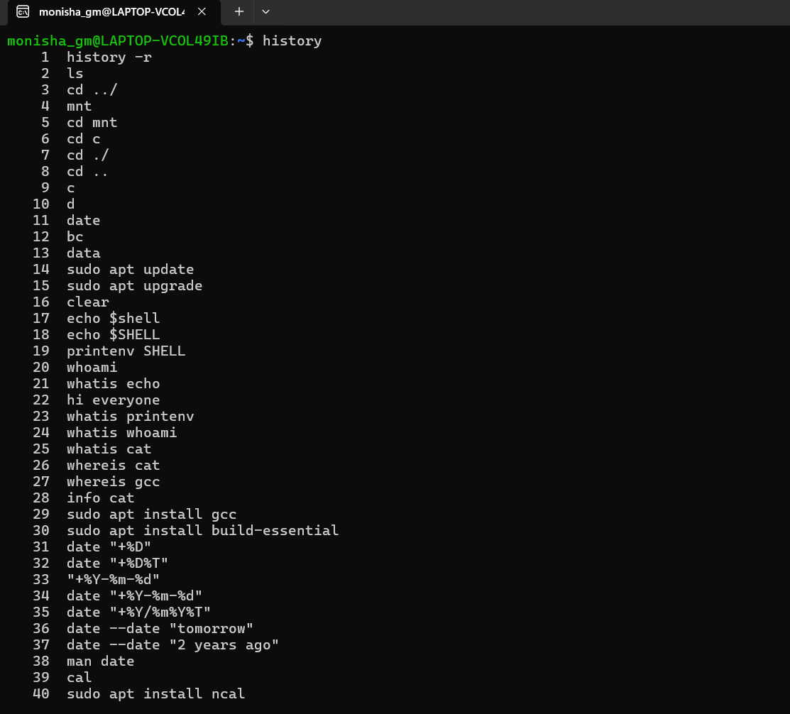
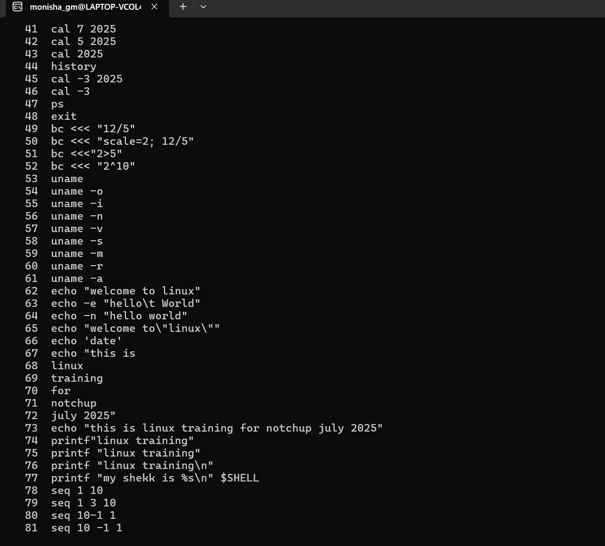
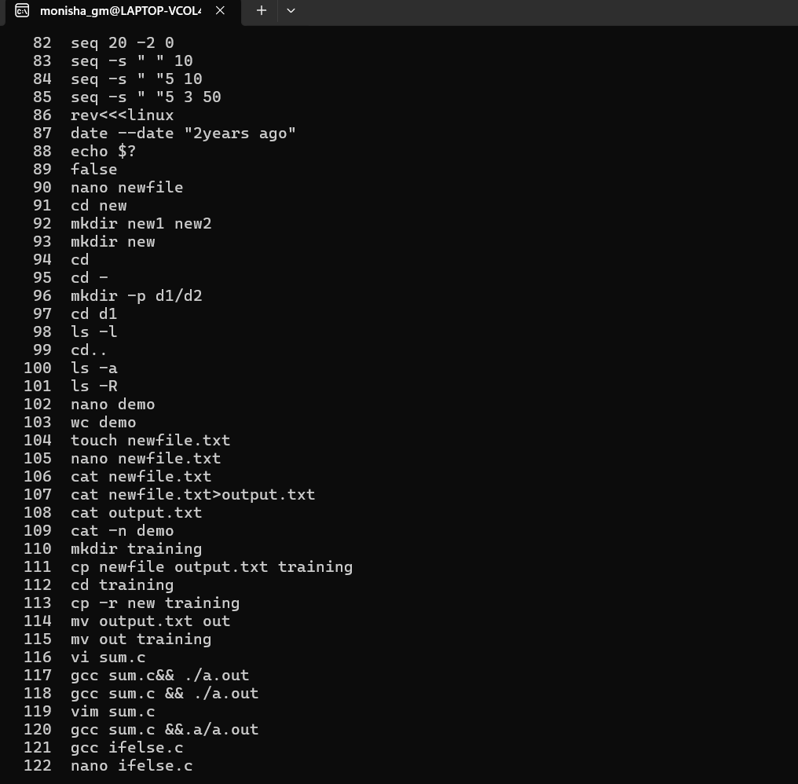
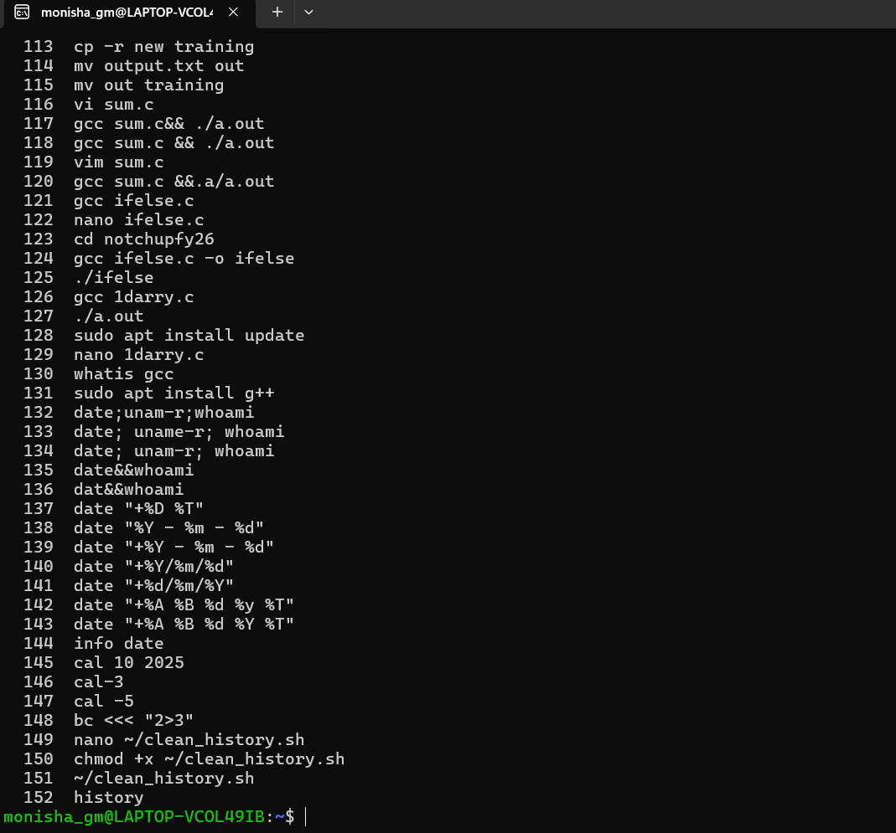

5186001_Monisha-G-M
## 🌟 Overview

Welcome to my repository! 🚀  
This space documents my **learning journey and hands-on practice** in the following areas:

- 📘 **Software Development Life Cycle (SDLC & Agile)**
- 🛠️ **Git & Version Control**
- 🐧 **Linux Command Line**
- 💻 **C Programming (Basics to Intermediate)**
- 🔗 **Unity testing with unity Framework**
- 🧪 **Problem Solving using HackerRank**
  

You'll find **certificates, exercises, and practical implementations** that highlight my progress and skills.

---

## 🚀 Quick Navigation

- 📘 [SDLC & Agile](./Agile_completion.png)
- 🛠️ [Git & Version Control](./git_week2)
- 🐧 [Linux Command Line](./linux_commands)
- 💻 [C Programming](./C%20Completion)
## 🏆 Certificates & Work

## ✅ Agile_completion

### ✅ Git_Training

### ✅ Linux_Commands

### ✅ C completion

