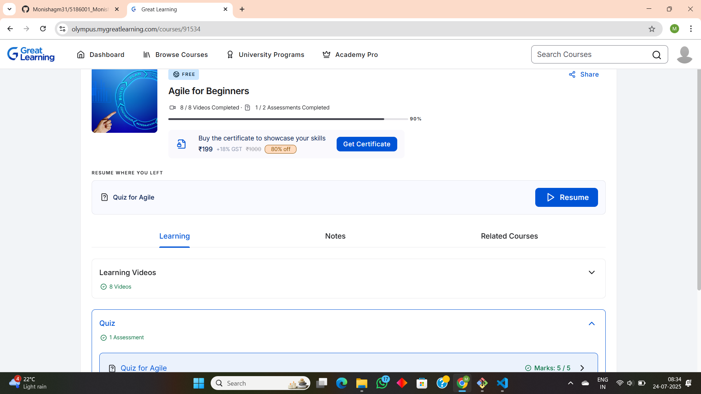

5186001_Monisha-G-M
## image
# AGILE COMPLETION

### image1

# GIT TRAINING CERTIFICATE

### image2

<<<<<<< HEAD
## [✔] C completion
  

  

 
  

  

=======
# C Intermediate certificate

### image3

# introduction to C certificate

### image4

>>>>>>> new-branch

